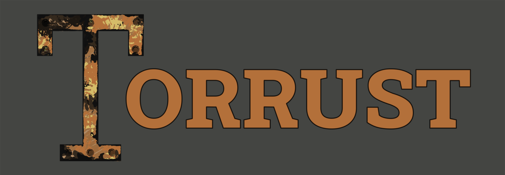

# Torrust Enhancement Proposals

Welcome!
This repository contains Torrust's enhancement proposals.

## What are TEPS and their purpose?

TEPS, stands for Torrust Enhancement Proposals. If you have an idea for a new feature, a suggestion for improvement, think that the project could benefit from something, go ahead and tell us.

We have created a TEP-Template for anyone to fill out and submit as

Python Enhancement Proposals

The PEPs in this repo are published automatically on the web at https://peps.python.org/. To learn more about the purpose of PEPs and how to go about writing one, please start reading at PEP 1. Note that the PEP Index (PEP 0) is automatically generated based on the metadata headers in other PEPs.

## Contributing to PEPs

See the Contributing Guidelines.